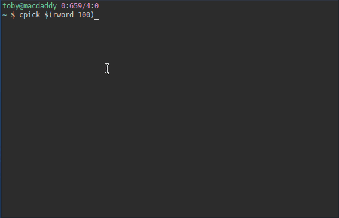

# CURSES LIST PICKER



*Pick items from a list with a nice TUI, & comfy Vi keybindings.*

## INSTALLATION

`pip install cpick`

## CLI USAGE

```
USAGE: cpick:

[-h]        [--help]
[-l LIMIT]  [--limit LIMIT]
[-n]        [--numbers]
[-H HEADER] [--header HEADER]
[-F FOOTER] [--footer FOOTER]
[ITEMS]     [items ...]

Curses List Picker.

Positional Arguments:
  [ITEMS]                : Items for the picker.

Optional Arguments:
  -h, --help             : Show this help message and exit.
  -l, --limit [LIMIT]    : Limit number of picks.
  -n, --numbers          : Show line numbers.
  -H, --header [HEADER]  : A string to use as a header.
  -F, --footer [FOOTER]  : A string to use as a footer.
```

## PYTHON USAGE

**Example using all available arguments**

``` python
import cpick

# keyword argument dictionary
kwargs = {
	# list to feed into the picker
	'items': ['a', 'list', 'of', 'items'],
	# only allow five items to be picked, defaults to sys.maxsize
	'limit': 5,
	# turn line numbering on
	'numbers': True,
	# defaults to 'PICK ITEMS FROM THIS LIST'
	'header': 'My Awesome Custom Header',
	# defaults to 'Press [?] to view keybindings'
	'footer': 'My Awesome Custom Footer',
}

# splat args using ** to unpack kwargs dictionary
picked = cpick.pick(**kwargs)

# print picked list
print(*picked, sep=", ")
# output if all items picked: a, list, of, items
```

**Example using only a list**

``` python
# pass in only mandatory arg - a list.
picked = cpick.pick(items=['just', 'a', 'list'])
print(*picked, sep=", ")
# output if all items picked: just, a, list
```

## KEYBINDINGS

| **KEY**      | **ACTION**                                |
|:-------------|:------------------------------------------|
| `k`,`UP`     | Move up one line                          |
| `j`,`DOWN`   | Move down one line                        |
| `g`,`HOME`   | Jump to first line                        |
| `G`,`END`    | Jump to last line                         |
| `f`,`PGDN`   | Jump down a page of lines                 |
| `b`,`PGUP`   | Jump up a page of lines                   |
| `#`          | Jump to line number                       |
| `/`          | Find items via wildcards, regex or range  |
| `n`          | Jump to next search result                |
| `p`          | Jump to previous search result            |
| `CTRL-n`     | Jump to next pick                         |
| `CTRL-p`     | Jump to previous pick                     |
| `r`,`F5`     | Reset search results and picks            |
| `z`,`CTRL-l` | Recenter current line on screen           |
| `RET`        | Pick an item                              |
| `;`          | Pick via wildcards, regex or range        |
| `u`          | Undo the last pick                        |
| `U`          | Undo the last pick and move to it\'s line |
| `t`          | Toggle an item                            |
| `SPC`        | Toggle item and go down a line            |
| `CTRL-SPC`   | Toggle item and go up a line              |
| `a`          | Toggle all items                          |
| `:`          | Toggle via wildcards, regex or range      |
| `v`          | View picked items                         |
| `?`,`F1`     | View this help page                       |
| `w`,`CTRL-s` | Save picks to a file                      |
| `q`,`ESC`    | Quit and display all marked paths         |

## NOTES

Picking`[;]`, toggling `[:]`, and searching`[/]` is supported via the following
methods:

- [Unix Style Wildcards](https://docs.python.org/3/library/fnmatch.html).
- [Regular Expressions](https://docs.python.org/3/howto/regex.html).
- Matching a complete string (ie. not substrings - use wildcards for this.)
- Specifying the line number of an item.
- Specifying a range of line numbers in the following forms:

  | **PROMPT** | **ACTION**                                            |
  |:-----------|:------------------------------------------------------|
  | `x..y`     | Match line numbers between *x* and *y*                |
  | `x-y`      | Match line numbers between *x* and *y*                |
  | `x..`      | Match line numbers from *x* until the end of the list |
  | `..y`      | Match line numbers from beginning of list until *y*   |
  | `x-`       | Match line numbers from *x* until the end of the list |
  | `-y`       | Match line numbers from beginning of list until *y*   |

These can also be combined. You can enter multiple patterns, ranges and strings
at one `Pick:`, `Toggle:` or `Find:` prompt.

However, be aware, that when toggling - if patterns, ranges or strings are
entered that match the same items, they will cancel each other out.

For example, if you entered `1..10 ^[A-Z][a-z]+$` on a list where the first 10
items were capitalised words, nothing would be picked.

The `1..10` would pick the first ten items, and then the `^[A-Z][a-z]+$` would
unpick them, since they call the toggle method consecutively.

If you do not want this *(you probably don't..)* - use the `Pick:` prompt
instead.

## EXAMPLES

Pick a number from 1 to 100, using custom header/footer and limiting picks to 5.

`cpick --header "My header" --footer "My footer" --limit 5 {1..100}`

Pick 5 random words from the dictionary, using the default header/footer.

`cpick --limit 5 $(shuf -n 100 /usr/share/dict/words)`

Pick an unlimited number of paths from the current directory.

`cpick $(ls)`
