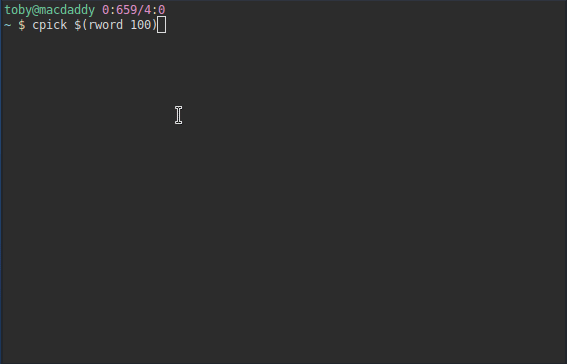

# CURSES LIST PICKER



*Pick items from a list with a nice TUI.*

## INSTALLATION

`pip install cpick`

## CLI USAGE

``` shell
usage: cpick [-h] items [items ...]

Curses list picker.

positional arguments:
  items       Items for the picker.

optional arguments:
  -h, --help  show this help message and exit
```

## PYTHON USAGE

``` python
import curses
from cpick import pick

item = ['a', 'list', 'of', 'items']

picked = curses.wrapper(pick, items)

print(picked)
```

## INTERFACE

| **KEYS**          | **ACTION**                                   |
|:------------------|:---------------------------------------------|
| `k`, `UP`         | Move up one line.                            |
| `j`, `DOWN`       | Move down one line.                          |
| `f`, `PGDN`       | Jump down a page of lines.                   |
| `b`, `PGUP`       | Jump up a page of lines.                     |
| `g`, `HOME`       | Jump to first line.                          |
| `G`, `END`        | Jump to last line.                           |
| `R`, `F5`         | Reset search results and picks.              |
| `z`, `Z`          | Recenter current line on screen.             |
| `s`, `SPC`        | Pick an item and go down a line.             |
| `u`, `U`          | Unpick an item and go up a line.             |
| `t`, `T`          | Toggle item pick status.                     |
| `a`, `A`          | Toggle picking of all items.                 |
| `;`, `*`          | Toggle via globbing,  regex or substring.    |
| `:`, `!`          | Toggle via index number or range of indices. |
| `/`               | Find items via glob pattern matching.        |
| `n`               | Jump to next search result.                  |
| `N`               | Jump to previous search result.              |
| `p`               | Jump to next pick.                           |
| `P`               | Jump to previous pick.                       |
| `?`, `F1`         | View this help page.                         |
| `q`, `ESC`, `RET` | Quit and display all marked paths.           |

## NOTES

Picking and searching can be done with globbing or regular expression pattern
matching or simply by searching for strings or substrings.

These can also be combined. You can enter multiple patterns at one `Find:` or
`Pick:` prompt.

However, be aware, that if two patterns are entered together that match the same
items they will cancel each other out, due to the toggling nature of the
resulting action.

This behavior is also due of when selecting by `Range:`.
